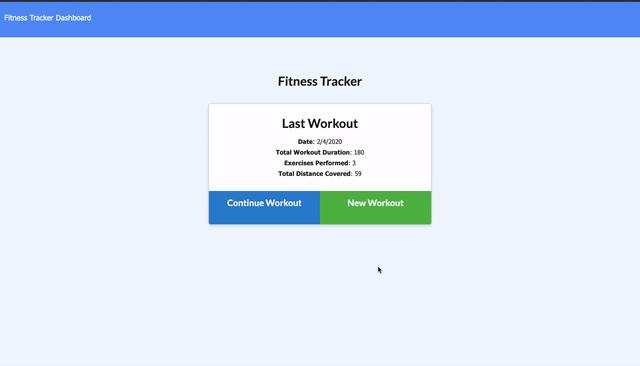

# Fitness Tracker

This application is a workout/fitness tracker that allows a user to create, track, and view daily workouts. They are given the option to log multiple workouts a day, and the application tracks the name, type, weight, sets, reps, and duration if it is a resistance exercise, and tracks the distance travelled if it is cardio. All of this information is populated in different charts for easy readability and as a way for users to look at all their workouts as a whole. Being able to track and keep progress of workouts will allow users to reach their fitness goals quicker.



## Deployed Link

[See Live Site](https://fitness-tracker-ry.herokuapp.com/)

## Technologies Used

* [HTML](https://developer.mozilla.org/en-US/docs/Web/HTML): used for structuring and creating elements on the DOM
* [CSS](https://developer.mozilla.org/en-US/docs/Web/CSS): used to style html elements on the page
* [JavaScript](https://developer.mozilla.org/en-US/docs/Web/JavaScript): used to create responsive, interactive elements on the page
* [Node.js](https://developer.mozilla.org/en-US/docs/Web/API/Node): JavaScript runtime, allows users to run JavaScript on the server
* [Express](https://expressjs.com/): Web framwork for node.js
* [Morgan](https://www.npmjs.com/package/morgan/v/1.1.1): Logging middleware for node.js http apps
* [MongoDB](https://www.mongodb.com/): document database
* [Mongoose](https://mongoosejs.com/): mongodb object modeling for node.js

## Code snippet

```
 app.put("/api/workouts/:id", (req, res) => {

        db.Exercise.create(req.body)
            .then((data) => db.Workout.findOneAndUpdate(
                {_id: req.params.id},
                { 
                    $push: {
                        exercises: data._id 
                    }, 
                    $inc: {
                        totalDuration: data.duration
                    } 
                },
                { new: true })
            )
            .then(dbWorkout => {
            res.json(dbWorkout);
            }).catch(err => {
                res.json(err);
            });
      });


```
This portion of the script file displays the PUT route for adding an exercise to a workout. First, '.create' is called on the Exercise model to save a document (req.body) to the database. This is then updated in the Workout model based on the unique id. THe '$push' operator appends the exercise ID to the array. The '$inc' object ensures that the total duration of a workout is updated if an exercise is added. The 'new' option is also set to true to return the document after the update was run. This information is finally returned as a JSON response. 

## Authors

**Rachel Yeung**
* [Portfolio](https://rachelyeung.herokuapp.com/)
* [Github](https://github.com/xrachhel)
* [LinkedIn](https://www.linkedin.com/in/rachel-yeung-814986159/)

